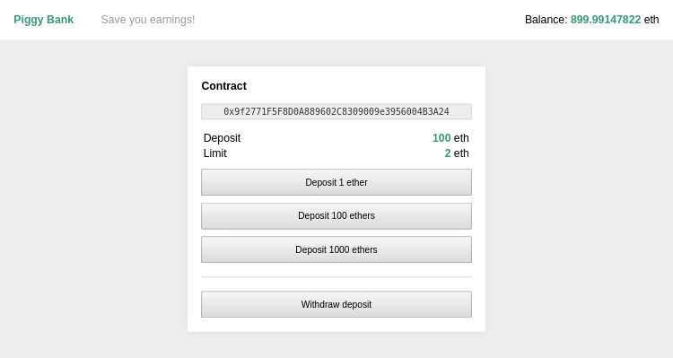

# Piggy Bank

Piggy bank is tutorial web application with Ethereum's smart contracts.
It demonstrates how to use web3 library to deploy and interact with smart
contracts, create web3 application powered with smart contracts and how
to test contracts with mocha package.



### Warning

This is only tutorial. And not a real application. It should not
be used in production.

### Installation

```shell
git clone git@github.com:rumkin/piggy-bank.git
cd piggy-bank
npm install .
```

It will install all required dependencies like web3, solc, ethereum testnet,
mocha and webserver.

### Testnet

To run steps 3, 4 and 5 you need to run testnet:

```
node bin/testnet.js
```

### Steps

There is several named files:

* `1-account.js` Creates secret key and balance for test net. Outputs `account.json`.
* `2-compile.js` Compiles contract and write result to `code.json`.
* `3-deploy.js` Deploy contract into testnet and write it's address to `contract.json`.
* `4-run.js` Run HTTP Server with simple UI to interact with contract.
* `5-destroy.js` Destroy contract and remove it from blockchain.

Repository already contains compiled template and test account. To run step
5 you need to deploy contract into testnet (`4-deploy.js`).

### Utils

* `bin/testnet.js` Run testnet.
* `bin/connect.js` Connect to running testnet with web3 and get active account.

### Contract

Contract allow to deposit money. Contract doesn't let owner to withdraw money
until some unchangable limit is riched:

```solidity
function canWithdraw() public constant returns (bool){
    return this.balance >= limit;
}

function withdraw() public isOwner {
    require(canWithdraw());

    owner.transfer(this.balance);
}
```

### UI

UI was created with Bundler.online. It's made for demonstration it's code is autogenerated. It's source is you can find at
http://bundler.online/rumkin/piggy-bank.

### License

MIT.
